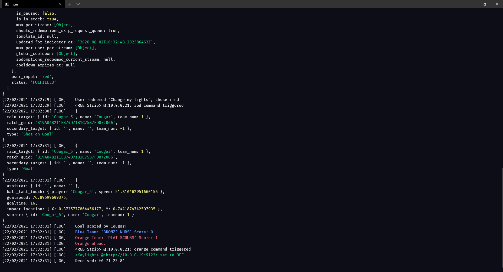

## Local RGB control server

Express/NodeJS/Websocket server  

- Launched at run time for stream

- Control of RGB strip/Elgato keylight fixtures

- NGROK tunnelling to Azure hosted Twitch bot
  - Bot is connected to a MongoDB Atlas cluster
  - API's at both ends to allow bidirectional communication between channel bot and local server
  - Bot can send lighting requests, song information, trigger OBS scene changes, etc.
  - Local server can send requests requiring DB access to the always online bot

- Socket.io emitter and consumer
  - Connects to SOS relay plugin in Rocket League to receive match data
  - Transform and emit that data to connected clients/React app
  - Allows use of RGB/keylight control tied in to game events for reactive lighting during streams

- Webhook/PubSub subscriber to connect to Twitch
  - Follows Oauth process for authentication and secure communication to Twitch
  - Heartbeat/keepalive functionality
  - New follower notifications
  - Channel point redemptions
    - Reactive lighting functionality for these events

- Websocket connection to Stream Elements
  - Donation notifications
    - Emit these payloads across to React app, allowing real time updates of prize pool information during streams
